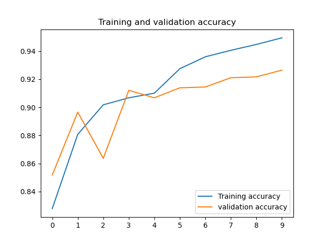
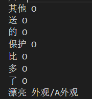

# Sentiment Analysis of Customer Reviews

## 1 项目背景

该项目为同济大学软件学院2021年专业方向综合项目，通过收集京东顾客的评论，进行情感分析生成顾客评论情感分析平台。本平台通过自然语言处理技术，对某一产品的评论进行情感分析，分析角度包括用户评论的角度、用户评论的态度、产品的质量、以及评论的质量。根据用户评论的褒贬和评论角度，生成自动回复内容，给商家回复进行参考。通过分析每个产品的大量评论数据，综合得出某项产品的各项指标，从而分析出该产品的特性。

### 1.1 项目组成员

| 姓名   | 文档分工                          |
| ------ | --------------------------------- |
| 董震宇 | 数据集的获取                      |
| 李金旗 | 介绍需求                          |
| 童语棋 | 深度学习，TextCNN，BiLSTM-CRF介绍 |
| 李家瑞 | 具体技术逻辑                      |
| 刘腾飞 | 为什么使用这个网络                |
| 梁荣嘉 | 前端技术说明                      |
| 李添一 | 自动打标签算法                    |

### 1.2 技术栈和工具

1. Node.js
2. React
3. Electron
4. Inno Setup Compiler

### 1.3 开发环境配置

1. 安装 node.js。
2. clone 已有代码。原仓库地址： https://github.com/icedancemelody/NLPSentimentAnalysis.git 。
3. 安装依赖。项目目录下执行 `npm install` 命令。

### 1.4 调试运行方法

要启动两个终端，一个运行前端代码，一个运行 Electron。

1. 运行前端：
   - 执行 `npm run react-start` （要关掉弹出的网页，网页版是不可用的）
2. 运行 Electron：
   - 确保 `main.js` 中 `const devMode = ture`
   - 在另一个终端执行 `npm run electron-start`，若成功则可看到应用已经启动

### 1.5 打包方法

不使用 electron-forge，使用 Inno Setup Compiler。

> Inno Setup Compiler 下载地址：https://files.jrsoftware.org/is/6/innosetup-6.1.2.exe 。使用浏览器访问该地址将直接下载。使用教程搜一搜就好了，简单的配置。

1. 确保 `main.js` 中 `const devMode = false`
2. 执行 `npm run build` ：构建 react 网页版
3. 执行 `npm run package` ：打包为绿色版程序，程序文件夹在 `./out`
4. 删除打包出来的程序文件夹中的 `resources/app/node_modules` 文件夹，以减小安装包体积
5. 使用 Inno Setup Compiler 打包

### 1.6 面向 Python 程序的接口

Python 程序放在 py 目录下，通过同目录下的 json 文件与前端传输数据。

- 前端向 Python 传：`py/dataToPy.json`
- Python 向前端传：`py/dataToNodeJs.json`

注意写入和读取使用 UTF-8 编码。

前端向 Python 传两种数据结构，一种对应单条分析，一种对应批量分析。数据结构如下：

1. 单条分析：

```json
{
    "comment": "评论内容"
}
```

2. 批量分析：

```json
{
    "data": [
        "评论内容1",
        "评论内容2",
        "评论内容3",
    ]
}
```

Python 向前端传两种数据结构，一种对应单条分析，一种对应批量分析。数据结构如下：

1. 单条分析：

```json
{
    "theDimension": "评论角度",
    "theAttitude": "评论态度",
    "theTextFeatures": "文字特征",
    "theReply": "自动回复"
}
```

2. 多条分析：

```json
{
    "data": [
        {
            "commentText": "评论内容",
            "dimension": "评论角度",
            "attitude": "正/负",
            "textFeatures": "文字特征",
            "reply": "自动回复"
        },
        {
            "commentText": "评论内容",
            "dimension": "评论角度",
            "attitude": "正面/负面",
            "textFeatures": "文字特征",
            "reply": "自动回复"
        }
    ]
}
```


## 2 项目成品展示

|  |  |
| ------------------------------------------------------------ | ------------------------------------------------------------ |
|  |  |


## 3 项目实现

### 3.1 数据集获取

#### 3.1.1 目的

采集京东商品评论信息，并带有评价类型以及评价标签。本次爬取评论为京东小米10手机的评论。（https://item.jd.com/65453105506.html）

#### 3.1.2 步骤

- **选定商品，查看URL**

- **分析接口数据**：

  - comments为评论列表
  - hotCommentTag为需要的评价标签
  - maxPage为可以获取最大页码数
  - 请求方式为GET

- **分析URL规律**：

  - 同一商品下的不同分页的url只有page值不同
  - 不同商品下的同一分页URL地址，只有productId不同，callback该参数可以省略
  - 对于同一商品的评价，callback中rid代表了不同的评价标签，callback中score表示评价类型（好评、中评和差评）。其中，score=1为差评，score=2为中评，score=3为好评，score=0为全部评价

- **代码爬取**：

  - 根据商品url地址发起请求获取响应结果，提取商品的id以及能获取的最大页码数量，拼接商品评论url地址，并将所有请求任务添加进线程池，伪代码如下：

    ```
    START
    	set baseURL
    	request and parse
    	if get requestbody:
    		load data
    		get maxPage
    		add tasks to thread pool
    	
    		get_each_page_link_url_list
    		get_each_page_link_url_num
    		get_each_page_title_list  makedir(title)
    		for each page:
    			request and parse
    			get callback result from URL
    		end
    		shutdown pool
    END
    ```

  - 解析商品评论接口返回的评论数据，注意这里返回的是一个json字符串，需要使用json.loads将json字符串转换为python数据类型然后取值，代码如下：

    ```python
    def parse_comments(self,future):
           response_text = future.result()
            if response_text:
                #解析数据
                comments = json.loads(response_text)['comments']
    
                for comment in comments:
                    commentInfo = {}
                    #姓名
                    commentInfo['nickName'] = comment['nickname']
                    #内容
                    commentInfo['content'] = comment['content']
                    #其他数据依次获取
    ```

  - 数据合并去重，伪代码如下：

    ```
    START
    	read data from excel use pandas
    	set display max rows
    	for each line and next line:
    		if the two lines are the same:
    			merge two lines' label
    			drop the second line
    			reset the index of data
    		end
    	end
    	save to excel
    END
    ```

#### 3.1.3 爬取结果


如下图，第一列为评论的用户ID，第二列为评论内容，第三列为评论日期，第四列为评论的态度，即好评、中评和差评，这里的1代表好评，第五列为评论的角度，可知此评论从充电和运行两个角度进行评论。


### 3.2 情感态度分析

#### 3.2.1 需求

对于用户的评论，我们需要能够将该评论进行归类，该评论是积极的还是消极的，是好评还是差评。情感态度分析是指用户评论整体上来看是积极的还是消极的，不仅仅局限于某一个角度。不过一般，如果评论的某一个角度是积极的，那其他角度的分析也往往是积极的。这里的态度分析更倾向于顾客是否喜爱这个商品，对商品是否满意。在实现这部分的功能时，我们面临着两种解决方案。一种是基于词典的方法，它需要通过制定一系列的情感词典和规则，对文本进行拆句、分析及匹配词典（一般有词性分析，句法依存分析），计算情感值，最后通过情感值来作为文本的情感倾向判断的依据。过程繁杂，涉及到拆解句子、处理否定逻辑、不同情感词不同的权重调参等等。第二种方法，是基于机器学习的方法。将情感分析作为一个有监督的分类问题，对于情感极性的判断，将目标情感分为三类：正、中、负。对训练文本进行人工标注，然后进行有监督的机器学习过程，并对测试数据用模型来预测结果。相比于第一种词典方法，基于机器学习的方法更简单通俗易懂，设计过程明朗。

#### 3.2.2 LSTM

长短期记忆网络（LSTM）是一种时间循环神经网络，是为了解决一般的RNN（循环神经网络）存在的长期依赖问题而专门设计出来的，所有的RNN都具有一种重复神经网络模块的链式形式。在标准RNN中，这个重复的结构模块只有一个非常简单的结构，例如一个tanh层。

由于独特的设计结构，LSTM适合于处理和预测时间序列中间隔和延迟非常长的重要事件。LSTM是一种含有LSTM区块（blocks）或其他的一种类神经网络，文献或其他资料中LSTM区块可能被描述成智能网络单元，因为它可以记忆不定时间长度的数值，区块中有一个gate能够决定input是否重要到能被记住及能不能被输出output。


#### 3.2.3 Word2Vec

词向量具有良好的语义特性，是表示词语特征的常用方式。词向量每一维的值代表一个具有一定的语义和语法上解释的特征。所以，可以将词向量的每一维称为一个词语特征。

Word2vec，是一群用来产生词向量的相关模型。这些模型为浅而双层的神经网络，用来训练以重新建构语言学之词文本。网络以词表现，并且需猜测相邻位置的输入词，在word2vec中词袋模型假设下，词的顺序是不重要的。训练完成之后，word2vec模型可用来映射每个词到一个向量，可用来表示词对词之间的关系，该向量为神经网络之隐藏层。


#### 3.2.4 技术逻辑

1. 构建数据集

   ​	利用爬虫技术获取了数据集，按照用户名、内容、评论时间、评论类型、评论角度划分成表格。数据集共8361条评论，好评6361条，中评1000条，差评1000条。这是电商平台展示的某手机的全部评论。为了达成情感态度分析任务，这里使用数据集中的评论部分，和评论类型（0：消极， 1：积极，2：中性）。实际进行的是文本分类任务。

2. 构建预训练词向量模型Word2Vec

   1. 从第三方库`gensim`中导入`Word2Vec`模型模板（无权重）

   2. 利用Pandas读取`.xlsx`表格的评论部分

   3. `JieBa`分词，得到每个句子分词后的产出：一个顺序词语数组。

   4. 对分词数组进行去空格，换行符分隔，得到输入模型前的句子格式。

   5. 训练Word2Vec模型，产出`word2vec.model`

      代码如下：

      ```python
      def train_word2vec(sentences,save_path):
          sentences_seg = []
          sen_str = "\n".join(sentences)
          # 分词
          res = jieba.lcut(sen_str)
          seg_str = " ".join(res)
          sen_list = seg_str.split("\n")
      
      
          for i in sen_list:
              sentences_seg.append(i.split())
      
          # print(sentences_seg) #所有句子的集合，每一个元素是词语的集合.其实就是分词结果
          # with open("data/words.txt", "w", encoding="utf-8") as f:
          #     # for word in w2id.keys():
          #     for sen in sentences_seg:
          #         print(sen,file = f)
          #         print()
          # f.close()
          # print(sentences_seg)  # 分词结果
      
          print("开始训练词向量")
      #     logging.basicConfig(format='%(asctime)s : %(levelname)s : %(message)s', level=logging.INFO)
          model = Word2Vec(sentences_seg,
                      vector_size=100,  # 词向量维度
                      min_count=5,  # 词频阈值
                      window=5)  # 窗口大小
          model.save(save_path)
          return model
      ```

3. 利用word2vec生成词向量矩阵

   ```python
   w2id,embedding_weights = generate_id2wec(model)
   ```

4. 训练文本分类模型LSTM

   1. ##### 利用`Keras`官方文档，搭建情感分类模型框架类

      这里的模型初始化接收的参数，是word2Vec产生的词向量矩阵

      类中train、predict方法利用`Keras`的API进行构建

      提供load_model供外部调用。

      代码如下：

      ```python
      # 封装模型和方法
      class Sentiment:
          def __init__(self, w2id, embedding_weights, Embedding_dim, maxlen, labels_category):
              self.Embedding_dim = Embedding_dim
              self.embedding_weights = embedding_weights
              self.vocab = w2id
              self.labels_category = labels_category
              self.maxlen = maxlen
              self.model = self.build_model()
      
          def build_model(self):
              model = Sequential()
              # input dim(140,100)
              model.add(Embedding(output_dim=self.Embedding_dim,
                                  input_dim=len(self.vocab) + 1,
                                  weights=[self.embedding_weights],
                                  input_length=self.maxlen))
              model.add(Bidirectional(LSTM(50), merge_mode='concat'))
              model.add(Dropout(0.5))
              model.add(Dense(self.labels_category))
              model.add(Activation('softmax'))
              model.compile(loss='categorical_crossentropy',
                            optimizer='adam',
                            metrics=['accuracy'])
              model.summary()
              return model
      
          def train(self, X_train, y_train, X_test, y_test, n_epoch=5):
              self.model.fit(X_train, y_train, batch_size=32, epochs=n_epoch,
                             validation_data=(X_test, y_test))
              self.model.save('sentiment.h5')
      
          def predict(self, model_path, new_sen):
              model = self.model
              model.load_weights(model_path)
              new_sen_list = jieba.lcut(new_sen)
              sen2id = [self.vocab.get(word, 0) for word in new_sen_list]
              sen_input = pad_sequences([sen2id], maxlen=self.maxlen)
              res = model.predict(sen_input)[0]
              return np.argmax(res)
      
          def load_model(self,modelPath):
              self.model.load_weights(modelPath)
      
      
      ```

   2. ##### 外部创建类实例，并执行train方法，得到sentiment.h5模型

      train方法规定训练**20**回合，划分原有数据集80%作为train队列，20%作为validation队列。

   3. **导入模型，利用predict方法，进行测试**

      ```python
      senti = Sentiment(w2id,embedding_weights,100,200,3)
      senti.load_model("sentiment.h5")
      
      
      # 模型预测
      label_dic = {0:"消极的",1:"积极的",2:"中性的"}
      while(1):
          sen_new = input("来个评论兄弟:")
          pre = senti.predict("./sentiment.h5", sen_new)
          print("'{}'的情感是:\n{}".format(sen_new, label_dic.get(pre)))
      ```

   4. ##### 模型训练收敛曲线

      训练20个回合，可以看出有明显的过拟合现象：

      - Accuracy收敛曲线

        

      - Loss收敛曲线

        

   5. ##### 调优措施

      在不加调优措施前，训练的曲线如下：

      - Accuracy收敛曲线

        

        Loss收敛曲线

        

        模型训练本身不加一下调优措施的效果已经很好，能够收敛0.92的准确率，训练20个回合，可以看出有明显的**过拟合现象**

        通过下面的方法，视为一些机器学习调参的尝试。

        - `DropOut(0.5)`使用。为模型手动添加`DropOut`层，通过选择50%的神经元权重遗忘措施，进行抗过拟合的操作。
        - `Adam`  optimizer。实验了一下发现效果很好，`learning-rate = 1e-3`。
        - `categorical_crossentropy`损失函数。多分类常用损失函数。
        - Epoch 20 -> 10。

        最终模型的收敛曲线为4所说。

   6. ##### 评估分析

      采用随机抽样1500条包含中、好、坏评论进行测试，统计模型预测结果，判断机器学习指标。

      | accuracy | specificity | precision | recall | f1-score |
      | -------- | ----------- | --------- | ------ | -------- |
      | 0.925    | 0.888       | 0.878     | 0.667  | 0.757    |


### 3.3 情感角度分析

#### 3.3.1 需求

为了更深入了解顾客对商品的评价，我们需要针对商品的各个角度的评价进行分析。不同于传统的情感分析二分类，只有积极和消极两个分类。我们对商品评论的分析，首先有整体语义上的分析：顾客对商品的评论整体上表达的评价，是积极还是消极，还是中性。其次，我们提取文字中的不同评论角度，针对不同角度进行了分析。比如，检测评论中是否涉及到手机的拍照方面，对手机的拍照效果是否满意。这使得我们不能仅仅使用一个普通的语料库进行积极和消极的判断。我们首先需要提取文字中的关键词，根据关键词判断文字涉及到的评论角度，再根据名词和形容词等方式进行评论角度和评价内容的一一对应，最后得出每个角度的评价。在这里可以采用的的方法有词典匹配方法和深度学习方法。

#### 3.3.2 BiLSTM-CRF

BiLSTM-CRF模型，现在已经成为命名实体识别、词性标注、分词等任务的主流模型。BILSTM-CRF模型主要包括两部分，即BILSTM层和CRF损失层。BILSTM层如下图所示，对于一个输入句子xxx，首先经过embedding层将每个词汇或者字符映射为一个词向量或者字符向量，然后传入BILSTM层，获得句子的前向和后向向量，接着将前向和后向向量进行拼接作为当前词汇或字符的隐藏状态向量。

在BILSTM每个时间步，虽然可以采用一个sorfmax层直接预测该时间步的标签，但是作者发现直接采用LSTM或者BILSTM进行预测效果一般，因为此时预测出来的标签并没有考虑前后标签的信息，在一些序列标注任务，比如命名实体识别，我们知道有些标签之前的转移是不合法的，比如人名我们一般是类似于“B-PER，I-PER，I-PER”的标注格式，如果采用LSTM或者BILSTM直接预测的话，可能预测出来的标签是“B-PER，B-PER，I-PER”，这时明显是不合法的。因此，为了考虑相邻标签的信息，作者在BILSTM层后接了一层CRF层，因为CRF不仅可以考虑当前输入的信息，还可以考虑前后标签的信息。


#### 3.3.3 为什么要使用BiLSTM-CRF

中文分词，词性标注，命名实体识别是自然语言理解中基础性的工作，同时也是非常重要的工作。本项目所使用的BiLSTM-CRF模型可以同时胜任这三种工作，而且效果还很不错。

在CRF层我们可以加入一些约束来保证最终预测结果是有效的。这些约束可以在训练数据时被CRF层自动学习得到。有了这些约束，错误的预测序列将会大大减少。

BiLSTM-CRF将LSTM和CRF结合在一起，优势互补。BiLSTM可以预测出每一个字属于不同标签的概率，然后使用Softmax得到概率最大的标签，作为该位置的预测值。这样在预测的时候会忽略了标签之间的关联性。在BiLSTM的输出层加上一个CRF，使得模型可以考虑类标签之间的相关性，标签之间的相关性就是CRF中的转移矩阵，表示从一个状态转移到另一个状态的概率，使得预测正确的概率大大增加。

#### 3.3.4 技术逻辑

1. **原理解释**

   ​		情感角度分析，其实我们的任务是识别这个一条评论中，体现了这条评论包含哪些评论角度的词语，这些词语可能是名词：（屏幕、手机屏），可能是动词（充电、操作）。

   ​		如果我们采用人为的句法解析，或者是词典匹配，甚至得细致到**把词语的词性**也纳入匹配机制，因为不同的**角度标签本身的词性也是名词和动词混杂**的。这个任务太艰巨了，更别说考虑**句式的多样性**，**网络评论内容本身的无句法规则性**，**评论网络用语过多**等问题

   ​		所以，如果我们能用深度学习的方式，把那些需要被识别的词语首先在句子中表明出来，然后让神经网络帮助我们探索这些特征，任务就变得稍微容易了一些，这也就是转化成了一个**序列标注**问题。

   ​		序列标注本身大多数情况使用人工标注的方式，来确保没有很大的误差保证训练前的工作到位。但是考虑到我们组只有7个成员人工标注8000多条评论属实比较困难，所以序列标注问题转化后，想要实现我们的需求，最核心的就是创建一个**合适的自动打标签算法**。

   **创新**：本次序列标注不仅标注了体现了被形容角度的词语，更尝试标注了形容这些角度的形容词，做到了多重识别。

2. 构建数据集

   ​		使用之前情感态度的数据集，这里不再赘述。

   ​		为了达成情感态度分析任务，这里使用数据集中的评论部分，和我们自己参考评论原本的评论角度，区分的7种评论角度，分别是：

   ​		**充电、外观、手感、屏幕、音效、运行、拍照**

3. BIO标注法

   ##### 打标签算法主要逻辑

   1.打开angles.txt，对其中7个方面中列举的各个词（形容词、名词等），去除其中的标点等，保存为词，按照“角度”和“具体词汇”将它们分别写入keys和values的list中；

   2.将评论数据中的内容去除标点符号，并形成一个新的字符串，用jieba分词工具进行分词，并确定其词性；

   3.对所有的词进行遍历，如果词语出现在了词典中，就在这个词的附近设置一个大小为5的窗口，判断其中是否有角度相关的词语；

   4.如果有，就给这个词打上这个角度的标签和词性；如果没有，就随机打上一个角度；如果这个词不在词典中，就打上不在词典中的标签；

   5.最后，将打上了标签的评论，重新保存在txt中。

4. 训练模型

   1. 由于数据量比较少且自构建打标签算法，本次序列标注任务的主要目标并不是识别数据集中没有的新型评论。它能够保证训练过的这些数据识别错误较少就已经很不错了，所以我将训练、验证、测试都使用全部的数据来完成。

   2. 使用第三点说到的BIO标注法进行标签赋予之后，最后的句子与标签格式样例如下：

      ```
      手 B-S-shougan
      感 I-S-shougan
      很 B-A-shougan
      棒 I-A-shougan
      本 O
      来 O
      还 O
      差 O
      点 O
      钱 O
      没 O
      想 O
      到 O
      碰 O
      上 O
      好 O
      人 O
      直 O
      接 O
      给 O
      我 O
      少 O
      ⑧ O
      佰 O
      的 O
      教 O
      程 O
      去 O
      它 O
      那 O
      问 O
      人 O
      很 O
      好 B-A-paizhao
      ```

   3. **将数据读入，利用网络上训练好的Bert模型进行词向量转化**

      ```python
      bert_embedding = BERTEmbedding('chinese_wwm_ext_L-12_H-768_A-12',
                                     task=kashgari.LABELING,
                                     sequence_length=256)
      ```

   4. **利用`kashgari`的API进行模型的训练**

      ```python
      model = BiLSTM_CRF_Model(bert_embedding)
      
      tf_board_callback = keras.callbacks.TensorBoard(log_dir='./logs', update_freq=1000)
      eval_callback = EvalCallBack(kash_model=model,
                                   valid_x=valid_x,
                                   valid_y=valid_y,
                                   step=10)
      
      model.fit(train_x, train_y, valid_x, valid_y, batch_size=16, epochs=5,callbacks=[eval_callback])
      ```

   5. **模型的评估**

      | 标签类型    | precision | recall | f1-score | support |
      | ----------- | --------- | ------ | -------- | ------- |
      | `chongdian` | 0.5916    | 0.5523 | 0.5713   | 5381    |
      | `pingmu`    | 0.6370    | 0.7690 | 0.6968   | 10659   |
      | `yinxiao`   | 0.7755    | 0.7225 | 0.7481   | 10571   |
      | `paizhao`   | 0.7235    | 0.7694 | 0.7458   | 12252   |
      | `shougan`   | 0.6990    | 0.5259 | 0.6002   | 5423    |
      | `yunxing`   | 0.8656    | 0.9058 | 0.8852   | 7897    |
      | `waiguan`   | 0.8025    | 0.6764 | 0.7341   | 9679    |

      | micro `avg` | 0.7309 | 0.7240 | 0.7274 | 61862 |
      | ----------- | ------ | ------ | ------ | ----- |
      | macro `avg` | 0.7344 | 0.7240 | 0.7258 | 61862 |

      评估分析：

      准确率：与二分类相同，预测正确的样本占总样本的比例，这里不做分析。
      精确率： ‘macro’， 对于每个标签，分别计算Precision，然后取不加权平均
      查全率： ‘macro’，对于每个标签，分别计算Recall，然后取不加权平均
      F1-Score：‘macro’， 对于每个标签，分别计算发，然后取不加权平均
      ‘micro’, 将n个二分类评价的TP,FP,FN对应相加，计算P和R，然后求得F1
      macro-f1和micro-f1都高，说明分类器性能好

### 3.4 前端技术说明

#### 3.4.1 系统架构


用户界面的实现使用web技术栈（HTML、JavaScript、CSS、React）实现。

服务端的网络请求处理使用Node.js实现。服务启动时Node.js将进行模型预测Python脚本执行为子程序，当接收到预测请求时，Node.js与Python通过标准输入输出stdio进行通信，Node.js得到预测结果后进一步处理，然后返回给用户端。	

在单条分析页面中，显示使用说明、提供评论输入框、分析结果显示，并对分析结果的文字特征进行了标注。

在多条分析页面中，显示使用说明、提供文件上传控件、统计结果显示、每条结果详细信息显示，并对每条评论的文字特征进行了标注。

#### 3.4.2 技术改进

1. 一开始，我们打算为用户做一个客户端，在用户机执行所有的模型预测等工作。
2. 随着项目进行，我们发现让用户在自己的计算机上配置软件所需的Python环境时很困难的，并且模型的体积太大，不好分发，所以我们将软件的使用方式改为通过浏览器线上使用。

### 3.5 项目中遇到的问题和解决方案

在定义评论标签的过程中，我们发现了脚本存在的一些问题。

1.有一些句子不存在主语，导致脚本无法正确打上标签。例如，拿着摸着很舒服，脚本无法识别舒服需要放在哪一个标签下，造成错误。

2.有的主语识别不清，脚本无法准确识别主语所属的类别，导致打标签结果出现问题，主语不在给定的示例中，但表示类似的含义。例如：后面的做的也很好看，扬声器也是安卓做好的了，立体声很棒。对于后面的以及扬声器等主语，脚本无法准确识别并理解主语含义和角度。

3.形容词和相应的主语不匹配。脚本会将一些不是用来形容标签的形容词识别出来并且打上相应的标签，例如：谢谢京东这么快！此处的快是用来形容京东物流，却被脚本打上充电的标签。

4.随意定义标签（找不到主语，随意定义）。有些句子不存在主语，使得脚本对于标签的定义存在随意性，例如：很是漂亮，也很流畅。脚本将漂亮打上了屏幕的标签，将流畅打上了外观的标签。

5.分词时如果同一个词存在于不同的角度，会打上不同的标签。对此，如上所述，设置了一个窗口，并对窗口内的词语进行检测（因为比如一个形容词，它的前后一般会有与之相关的名词等等，以此所谓对这个词语进行角度匹配的依据。也尝试过进行模糊搜索，但因为一个评论中，往往包含着几个不同角度的评论，所以效果不佳，在进行尝试和比对实验之后，决定还是采用窗口检测的方法。

6.分词时无法进行词性的判断。为此，在参考了一些工具包后，决定采用jieba的语言处理包，对词语的词性进行判断，并对结果分别打上对应的标签，以此满足后续数据处理的要求。

7.分词的效果不佳。在进行了一系列的尝试后，我们修改了一些逻辑上的细节，并且对我们原先直接爬虫得到的词典进行了人工筛选，得到了令人满意的打标签结果。

8.评价类的形容词一定会被指定到一个角度，但实际上并不应该这样。比如：


”其它各方面都很好“中的”好“被指定为充电角度，但事实上明显不应如此。


”两排设置的确实有较大的提升“根据上文可以判断出指的是手机外观上两排摄像头的设计，而机器却将”较大“归类于音效的角度。

9.机器判断的句式比较单一，稍微一换句子结构，其结构就会表现的不尽人意。比如，机器习惯于判断”名词+形容词“性的句式，但是不一定现有名词，才有形容词。比如：


这里就是”形容词+名词”的句式，这里因为“照片”不在“漂亮”的前面，所以机器没有将“漂亮”归类到拍照领域，而是错误的分类到外观。

10.机器本身分词也有不准确的情况，当然也可能是因为数据源本身的错误和一些特殊字符和表情无法处理。



“其它送的保护比多了漂亮”，明显句义不通，丢失了一些词。


“晚上锻炼外放还是很给的”明显少掉了“力”字，应该是“晚上锻炼外发还是很给力的”。

11.机器倾向于一个名词对应一个形容词。但是由于表达的灵活性，一个名词可以对应多个形容词，或者多个名词对应一个形容词。比如：


“显示也挺赞挺高的”中有两个形容词，“挺赞的”和“挺高的”都是形容“显示”的，但是只有“挺高的”被打上“屏幕”的标签，“挺赞的”没有被分类。

12.分类也会不准确，比如


一亿不是盖的，非常清晰，都可以当相机用了”中“清晰”明显指的是拍照清晰，应被分类到拍照，但是机器却分类到手感。


“设计真心好”指的是外观设计，所以“好”应该被分类到外观，但是却被分类到“音效”。
